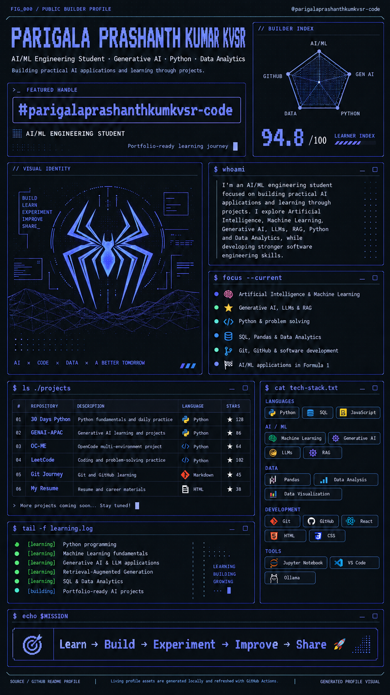

<div align="center">



# Parigala Prashanth Kumar KVSR

### AI/ML Engineering Student · Generative AI · Python · Data Analytics

[](https://git.io/typing-svg)


**Learn → Build → Experiment → Improve → Share 🚀**

</div>

---

## `$ whoami --verbose`

<div align="center">

</div>

I'm an **AI/ML engineering student** focused on building practical AI applications and learning through projects.

I explore **Artificial Intelligence, Machine Learning, Generative AI, LLMs, RAG, Python, and Data Analytics** while building stronger software engineering skills.

<div align="center">

</div>

---

## `$ focus --current`

- 🧠 Artificial Intelligence & Machine Learning
- ⭐ Generative AI, LLMs & RAG
- 🐍 Python & problem solving
- 📊 SQL, Pandas & Data Analytics
- 🔗 Git, GitHub & software development
- 🛠️ OpenCode skills, agents & multi-environment setups
- 🏁 AI/ML applications in Formula 1

---

## `$ ls ./projects --organized`

> All links use the correct account: `parigalaprashanthkumarkvsr-code`

| # | Repository | Description |
|---|---|---|
| 01 | [PYTHON-BEGGINER-FOR-30-DAYS](https://github.com/parigalaprashanthkumarkvsr-code/PYTHON-BEGGINER-FOR-30-DAYS) | Python fundamentals and daily practice (Jupyter Notebook) |
| 02 | [GENAI-APAC](https://github.com/parigalaprashanthkumarkvsr-code/GENAI-APAC) | Generative AI learning and projects |
| 03 | [OC-ME](https://github.com/parigalaprashanthkumarkvsr-code/OC-ME) | OpenCode skills, agents and resources |
| 04 | [MY_SKILLS_AGENTS](https://github.com/parigalaprashanthkumarkvsr-code/MY_SKILLS_AGENTS) | All skills and agents collection |
| 05 | [MY_RESUME](https://github.com/parigalaprashanthkumarkvsr-code/MY_RESUME) | Resume and career materials |
| 06 | [git-journey](https://github.com/parigalaprashanthkumarkvsr-code/git-journey) | Git and GitHub learning |
| 07 | [leetcode](https://github.com/parigalaprashanthkumarkvsr-code/leetcode) | Coding and problem-solving practice (fork) |
| 08 | [my-project](https://github.com/parigalaprashanthkumarkvsr-code/my-project) | Experiments and scratch project |
| 09 | [o](https://github.com/parigalaprashanthkumarkvsr-code/o) | Agent harness performance system (fork) |

> More projects coming soon... Stay tuned!

---

## `$ cat tech-stack.txt`

### Languages


### AI / ML


### Data


### Development


### Tools


---

## `$ stats --github`

<div align="center">


</div>

<div align="center">

<br/>
<sub>Contribution graph auto-refreshes daily via GitHub Actions. See <code>tools/</code> and <code>.github/workflows/refresh-graph.yml</code>.</sub>
</div>

---

## `$ tail -f learning.log`

```text
[learning] Python programming
[learning] Machine Learning fundamentals
[learning] Generative AI & LLM applications
[learning] Retrieval-Augmented Generation
[learning] SQL & Data Analytics
[building] OpenCode skills & agents
[building] Portfolio-ready AI projects
```

---

## `$ tree --organized`

```text
parigalaprashanthkumarkvsr-code/
├── README.md                    # this profile page (root required by GitHub)
├── assets/
│   ├── profile-dashboard.png    # hero banner (relative path, renders on profile)
│   ├── sysinfo.svg              # whoami terminal card
│   ├── portrait.svg             # identity ascii card
│   └── graph.svg                # living contribution graph (auto-updated)
│       └── contributions.json   # generated daily by Actions (gitignored locally)
├── tools/
│   ├── pull_contributions.py    # fetch contribution calendar
│   ├── render_graph.py          # render assets/graph.svg
│   ├── render_portrait.py       # avatar → ascii portrait
│   ├── requirements-art.txt
│   └── requirements-daily.txt
├── docs/
│   └── SETUP.md                 # setup / publishing notes
└── .github/
    └── workflows/
        └── refresh-graph.yml    # daily auto-refresh
```

---

## `$ echo $MISSION`

<div align="center">

**Learn → Build → Experiment → Improve → Share 🚀**

</div>
