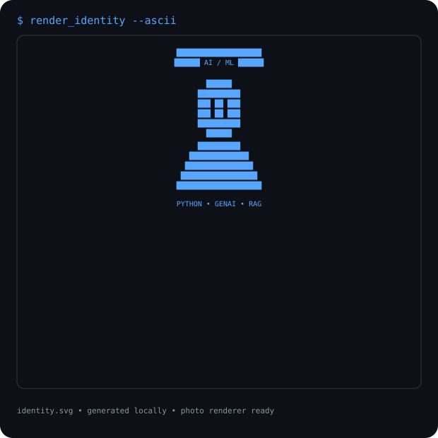
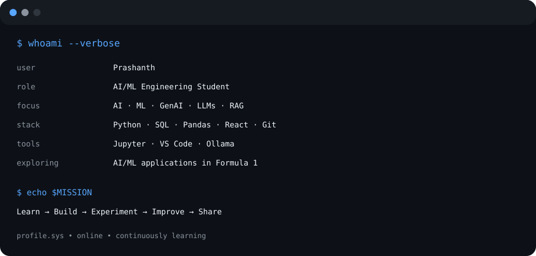

<div align="center">

# <code>parigalaprashanthkumkvsr-code</code>

### AI/ML Engineering Student · Generative AI · Python · Data Analytics


<br>

<table>
<tr>
<td valign="top">

</td>
<td valign="top">

</td>
</tr>
</table>

</div>

---

## <code>$ whoami</code>

I'm an AI/ML engineering student focused on building practical AI applications and learning through projects.

I explore **Artificial Intelligence, Machine Learning, Generative AI, LLMs, RAG, Python and Data Analytics**, while developing stronger software engineering skills.

## <code>$ focus --current</code>

- 🤖 Artificial Intelligence & Machine Learning
- 🧠 Generative AI, LLMs & RAG
- 🐍 Python & problem solving
- 📊 SQL, Pandas & Data Analytics
- 💻 Git, GitHub & software development
- 🏎️ AI/ML applications in Formula 1

## <code>$ ls ./projects</code>

| Repository | Description |
|---|---|
| [30 Days Python](https://github.com/parigalaprashanthkumsvr-code/PYTHON-BEGGINER-FOR-30-DAYS) | Python fundamentals and daily practice |
| [GENAI-APAC](https://github.com/parigalaprashanthkumsvr-code/GENAI-APAC) | Generative AI learning and projects |
| [OC-ME](https://github.com/parigalaprashanthkumsvr-code/OC-ME) | OpenCode multi-environment project |
| [LeetCode](https://github.com/parigalaprashanthkumsvr-code/leetcode) | Coding and problem-solving practice |
| [Git Journey](https://github.com/parigalaprashanthkumsvr-code/git-journey) | Git and GitHub learning |
| [My Resume](https://github.com/parigalaprashanthkumsvr-code/MY_RESUME) | Resume and career materials |

## <code>$ cat tech-stack.txt</code>

**Languages:** Python · SQL · JavaScript  
**AI/ML:** Machine Learning · Generative AI · LLMs · RAG  
**Data:** Pandas · Data Analysis · Data Visualization  
**Development:** Git · GitHub · React · HTML · CSS  
**Tools:** Jupyter Notebook · VS Code · Ollama

## <code>$ tail -f learning.log</code>

```text
[learning] Python programming
[learning] Machine Learning fundamentals
[learning] Generative AI & LLM applications
[learning] Retrieval-Augmented Generation
[learning] SQL & Data Analytics
[building] Portfolio-ready AI projects
```

## <code>$ echo $MISSION</code>

**Learn → Build → Experiment → Improve → Share 🚀**

---

<div align="center">

<sub>Living profile assets are generated locally and refreshed with GitHub Actions.</sub>

</div>
