

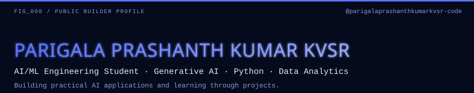

**AI/ML Engineering Student · Generative AI · Python · Data Analytics**

*Building practical AI applications and learning through projects.*


## Visual identity

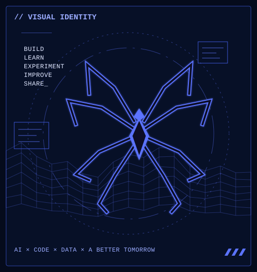

## About me · Builder index

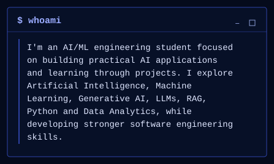
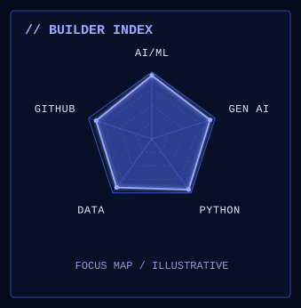

## Current focus

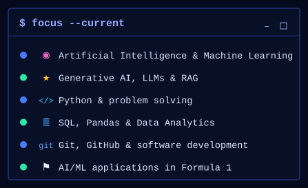

## Projects

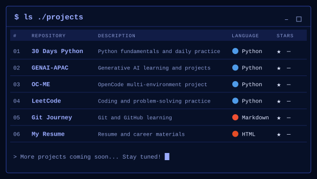

| # | Repository | Description | Language |
|---|---|---|---|
| 01 | [PYTHON-BEGGINER-FOR-30-DAYS](https://github.com/parigalaprashanthkumarkvsr-code/PYTHON-BEGGINER-FOR-30-DAYS) | Python fundamentals and daily practice | Python |
| 02 | [GENAI-APAC](https://github.com/parigalaprashanthkumarkvsr-code/GENAI-APAC) | Generative AI learning and projects | Python |
| 03 | [OC-ME](https://github.com/parigalaprashanthkumarkvsr-code/OC-ME) | OpenCode multi-environment project | Python |
| 04 | [leetcode](https://github.com/parigalaprashanthkumarkvsr-code/leetcode) | Coding and problem-solving practice | Python |

## Tech stack

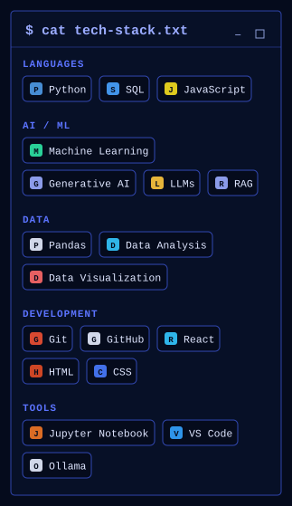

## Learning log

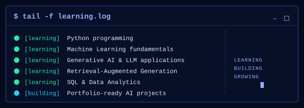

## Activity · Contribution graph

 
Living contribution graph auto-refreshed daily via GitHub Actions.

## Mission

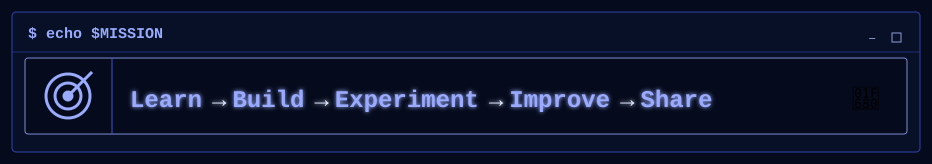

Optional handle card and single-image layout

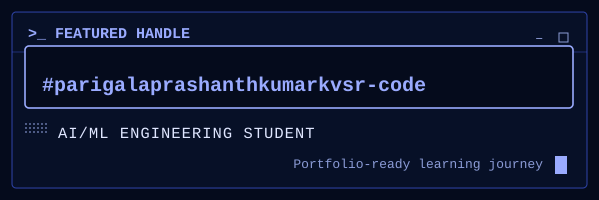

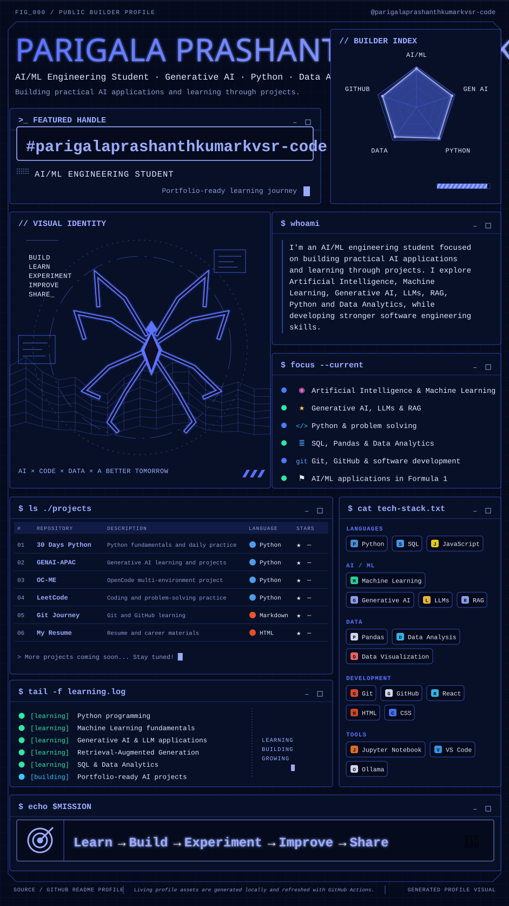

---

Custom SVG design · Modular GitHub README · No remote image dependencies

<!-- SETUP: For profile visibility, put this README at the root of a PUBLIC repository whose name exactly matches your actual GitHub username. Change any profile details and project names that have not been verified. -->
